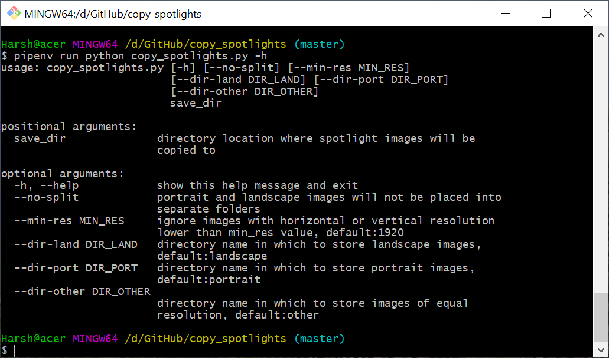
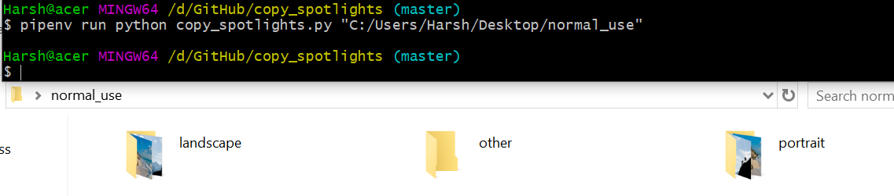
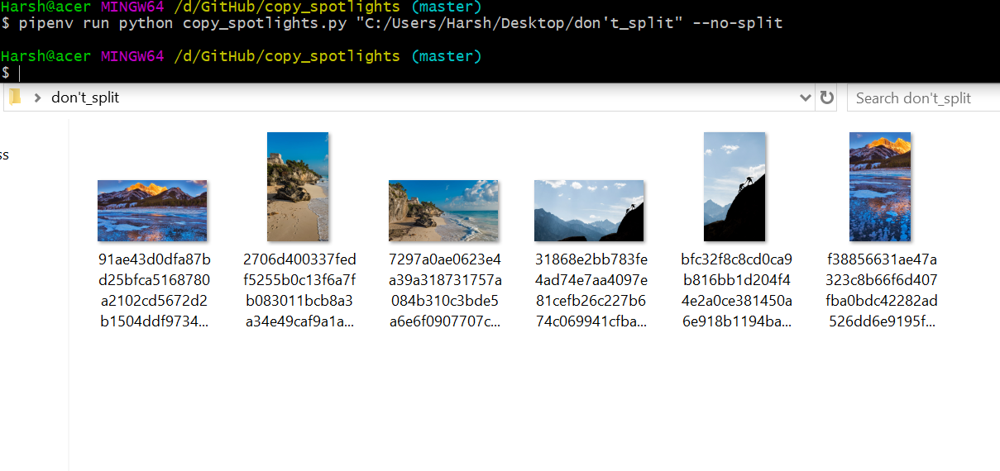
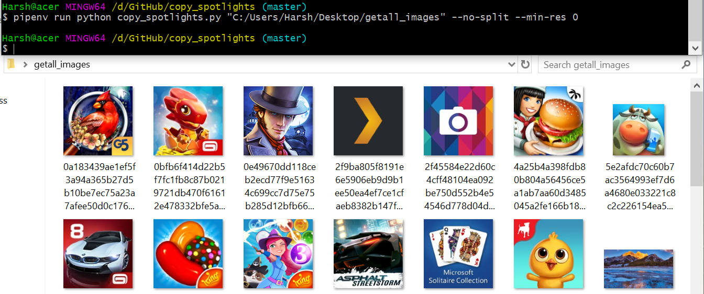
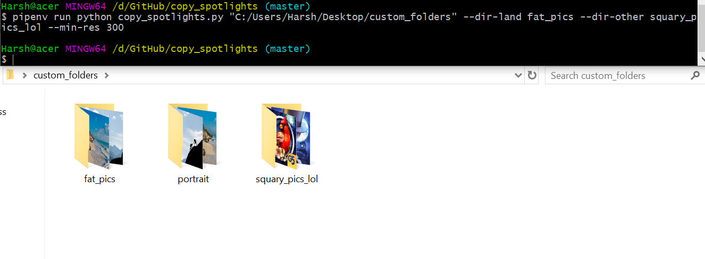

# copy-windows10-spotlight_images
Love windows 10 spotlight images that show up on lock-screen. Then here's a simple program to copy those images and get them in your preferred directory.

## Simplified pre-requisites
Have gitbash, and python with pip installed.

Open gitbash. Install pipenv using pip. Specifically, run <code>$ pip install pipenv</code>

Download this project. You can download by running
<code>$ git clone https://github.com/DevilLordHarsh/copy-windows10-spotlight_images</code>

Make sure you are in the root of the project, and run
<code>$ pipenv install</code>

All set!

## Usage examples

### Help section

### Normal usage

### Save in single directory

### Include images by resolution

### Custom directory names

